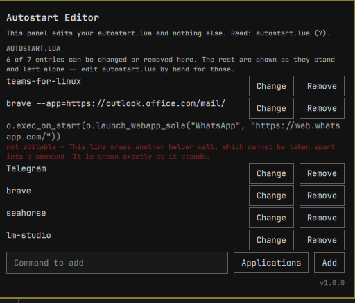

# Autostart Layout

An Omarchy bar widget for Hyprland: choose which programs start with your
session, and where their windows go.



## What it does

Four things, all from one panel behind a bar button:

1. **A list of programs to start with your session.** Each row has a name, a
   command line and an on/off switch. Rows are added from your installed
   applications, or imported from the session you are running right now.
2. **A placement per program** -- a workspace, or a monitor. The plugin sets
   the matching window rule so the program's window lands there.
3. **A workspace-to-monitor table.** Workspace 3 always on `DP-4`, and so on.
4. **A "Launch missing" button** for the enabled programs that have no window
   at the moment, so you do not have to log out to try your list.

Nothing here needs elevated rights. There is no `--system` tier, no elevation
helper, no package installation, and no rule file of any kind. Everything the
plugin does, it does as you, in your own configuration directory.

### What it needs

- Hyprland with Omarchy's Quickshell-based shell (this is a `bar-widget` plus
  `service` plugin, schema version 1).
- `hyprctl`, `jq`, `bash`, `grep`, `timeout`, `setsid`, `mktemp` -- all of
  them part of a stock Omarchy install. Nothing is fetched at runtime and the
  plugin makes no network connection at all.

### When something else is a better fit

If you only want a fixed list of programs to start and do not care where their
windows land, `~/.config/hypr/autostart.lua` already does that in two lines per
program and costs you no widget. This plugin earns its place when the
*placement* is the part you keep redoing by hand -- the browser on workspace 2
of the left screen, the terminal on the right one, every session.

## Install

```bash
git clone https://github.com/SmartALB/omarchy-autostart-layout.git
cd omarchy-autostart-layout
./install
omarchy-restart-shell
```

`./install` copies the plugin to
`~/.config/omarchy/plugins/smartalb.autostart/` and prints what to do next. It
refuses to run as the root user, because it installs into a per-user
configuration directory.

Then add the widget to your bar. Either use Omarchy's own plugin screen, or
add the id to a bar section in `~/.config/omarchy/shell.json`:

```json
{ "bar": { "layout": { "right": [ { "id": "smartalb.autostart" } ] } } }
```

The same entry is what enables the background part of the plugin, the one that
applies your list at login -- there is no second switch to find.

### Removal

```bash
./uninstall
```

It removes the plugin directory and the session start marker. Remove the
widget from your bar in `shell.json` yourself afterwards, then run
`omarchy-restart-shell`. Your configuration file is deliberately **kept**, so
a reinstall finds your list again; the uninstaller prints its path so you can
delete it on purpose.

## How placement works

In Hyprland a workspace lives on exactly one monitor. That is why a program's
placement is an **either-or** and not two fields: pinning a program to
workspace 3 *and* to `DP-2` would be a contradiction the moment workspace 3
sits on `DP-4`, and the panel refuses that combination rather than silently
picking one.

> If you want a program on a particular screen and do not care about the
> workspace number, choose monitor. If you think in workspaces, choose
> workspace and pin the workspace to a monitor in the table below.

The panel shows the resulting monitor greyed out next to a workspace choice,
so you can see which screen a workspace choice actually implies.

## Where your data lives

One file:

```
~/.config/omarchy/autostart-layout.json      (mode 0600)
```

That file holds **command lines that are run as you when your session
starts**. It is the same trust level as `~/.config/hypr/autostart.lua`, and it
is worth reading with that in mind before you paste a command into it.

Two consequences, both deliberate:

- The plugin writes that file with mode `0600` and **applies nothing at all**
  if it ever becomes writable by anyone else. It then says so in the panel and
  tells you the exact command to put the mode back. A file another account can
  edit is a file another account can use to run programs as you.
- The plugin touches no other configuration. It does not write to
  `hyprland.conf`, to any `.lua` under `~/.config/hypr/`, or to your
  `shell.json`; it never overwrites configuration you did not change in its
  own panel, and the panel changes nothing until you press **Apply**.

## How it applies

No Hyprland configuration file is edited. The rules are set at runtime in the
running compositor -- window rules for the programs, workspace rules for the
table -- and they live only there.

Two things follow from that:

- A manual `hyprctl reload` drops them, because a reload rebuilds the
  compositor's rule set from the configuration files, which never contained
  them. The background part of the plugin notices the reload and puts them
  back, so the gap is short rather than permanent.
- Nothing is left behind when you remove the plugin. Log out, or run
  `hyprctl reload`, and the rules are gone.

**What the plugin cannot tell you:** whether a program you configured actually
started. Programs are launched detached from the shell, and a misspelled
command, a missing binary and a program that exits immediately all look the
same from here -- no output, no failing status. The one honest report the
plugin can give is the other way round: it counts the enabled programs for
which **no window ever matched**, says so under the list, and offers *Launch
missing*. If a row is listed there, the usual cause is a misspelled command or
a window-class pattern that matches nothing; open the row and check both.

## Known limits

- Workspaces 1 to 99 only. Named workspaces are not supported.
- Placement is workspace or monitor. There are no `float`, `size`, `maximize`
  or `fullscreen` rules -- this is not a general window-rule editor.
- Placement matches on window class, so several windows of the same class go
  to the same place. One rule per class, not per window.
- An application whose window class is not known until it has run once needs
  **From window** pressed once: start it, then pick its window from the list
  and the class is filled in for you.
- An imported window whose class matches no installed application arrives with
  an empty command on purpose. The plugin does not guess a command from a
  window class; fill it in and the row starts working.
- At most 200 programs, a 100-character name and a 500-character command per
  row.

## Development

Three traps, each with the symptom you will recognise it by:

- **Run `omarchy-restart-shell` after every QML change.** The develop guide
  says saved changes reload automatically; for bar widgets that is not true.
  *Symptom:* the journal writes `Local plugin changed, reloading`, and the
  widget still behaves like the previous version -- diagnostic output you just
  added does not fire at all.
- **After touching a plugin file, wait about 8 seconds before measuring
  anything.** The inotify watcher reloads the shell and takes running
  `Process` objects down with it. *Symptom in the journal:*
  `another handler is registered for target`.
- **Use `/usr/lib/qt6/bin/qml` for the test suite.** `/usr/bin/qml` on Arch is
  Qt 5.15, does not load the harness at all, and exits 2 -- which collides
  with the runner's own "cannot run". The tool that fails with **no output
  whatsoever** and status 1 is `/usr/bin/qmltestrunner`, which is why it is
  not used here. The runner's four exit codes: `0` green, `1` a test failed,
  `2` cannot run, `3` the harness itself broke, `4` the assertion-count guard
  failed.

`CHECKLIST.md` lists everything no automated test in this repository can
settle -- every claim that needs a running Hyprland session to confirm.

## Tests

```bash
./test/run-tests.sh        # the bin/ scripts, the manifest, install/uninstall
./test/run-qml-tests.sh    # Model.js, headless, in the Qt6 engine
./test/qml-structure.sh    # structural checks over the QML files
./test/runners-shape.sh    # the shape of every command Runners.qml builds
./test/lua-syntax.sh       # the Lua chunks compile
./test/mutations.sh        # every test above, checked against its own mutation
```

`mutations.sh` is the one worth explaining: it breaks a guarded property on
purpose, one at a time, and fails if the suite stays green. A test that
survives the removal of the thing it tests was never testing it.

## License

MIT. See `LICENSE`.
